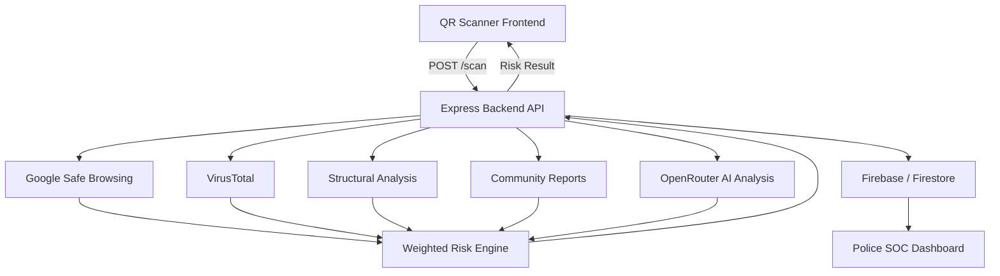

# 🛡️ QR Shield AI

**QR Shield AI** is a full-stack cybersecurity platform that analyzes QR code payloads and URLs to identify phishing attempts, malicious domains, suspicious links, and QR-based fraud.

Instead of relying on a single AI model or threat-intelligence service, QR Shield AI combines multiple security signals through a weighted risk engine to generate an explainable risk score.

The project was built and tested during a hackathon, where the team worked through production deployment issues, CORS configuration, external API failures, database quota exhaustion, and real-world debugging under time constraints.

## 🌐 Live Demo

**Frontend:** https://qr-sheild-ai.vercel.app

**Backend API:** https://qrsheildai.onrender.com


---

## 🎯 Problem Statement

QR codes are widely used for payments, websites, menus, authentication, and information sharing.

However, users cannot easily inspect the destination or intent of a QR code before opening it.

Attackers can exploit this behavior through:

- Phishing URLs
- Typosquatted domains
- Malicious websites
- Fake payment links
- Suspicious URL shorteners
- Social-engineering attacks
- QR-code replacement attacks

QR Shield AI provides a security analysis layer between scanning a QR code and trusting its content.

---

## 💡 Solution

QR Shield AI decodes the QR payload and sends it through a multi-signal threat-analysis pipeline.

The platform evaluates the payload using:

- Google Safe Browsing
- VirusTotal
- Structural URL analysis
- Community report signals
- AI-assisted contextual analysis through OpenRouter

These signals are processed by a deterministic weighted risk engine.

The AI model does not directly control the final risk score.

The final result includes:

- Risk score
- Risk classification
- Threat category
- Confidence
- Technical indicators
- Threat-intelligence evidence
- AI-generated contextual explanation
- Recommended action

---

## ⚙️ How It Works

```text
QR Code / URL
      │
      ▼
Payload Extraction
      │
      ▼
Backend Scan API
      │
      ├────────► Google Safe Browsing
      │
      ├────────► VirusTotal
      │
      ├────────► Structural URL Analysis
      │
      ├────────► Community Reports
      │
      └────────► AI Contextual Analysis
                         │
                         ▼
                 Weighted Risk Engine
                         │
                         ▼
                Explainable Risk Result
                         │
                         ▼
              Scanner UI / Security Dashboard
```

---

## 🧠 Risk Scoring Architecture

QR Shield AI uses a weighted scoring system with a maximum score of 100.

| Security Signal | Maximum Contribution |
|---|---:|
| Google Safe Browsing | 40 |
| VirusTotal | 30 |
| Structural Signals | 15 |
| Community Reports | 10 |
| AI Context | 15 |

The final score is capped at `100`.

### Why use a weighted engine?

External security services and AI models can produce incomplete, unavailable, or conflicting results.

QR Shield AI therefore separates **evidence collection** from **risk-score calculation**.

For example:

- Google Safe Browsing can provide verified threat intelligence.
- VirusTotal provides detection results from multiple security engines.
- Structural analysis identifies signals such as insecure HTTP connections and suspicious URL patterns.
- Community reports provide supporting reputation signals.
- AI provides contextual reasoning but cannot independently mark unverified observations as confirmed evidence.

This approach makes the system more explainable and reduces dependence on a single AI model.

---

## ✨ Key Features

- QR scanning using device camera
- QR image upload and drag-and-drop support
- URL and QR payload analysis
- Weighted risk-scoring engine
- Google Safe Browsing integration
- VirusTotal threat-intelligence integration
- AI-assisted contextual analysis using OpenRouter
- Explainable risk breakdown
- Technical security indicators
- Offline/local fallback analysis
- Scan history
- Authentication system
- Police/SOC monitoring dashboard
- Geographic incident visualization using Leaflet
- Security analytics using Chart.js
- Progressive Web App support
- Service Worker caching
- Responsive interface
- API rate limiting
- Security headers using Helmet
- CORS allowlist for deployed frontend origins

---

## 🖥️ Police / SOC Dashboard

QR Shield AI includes a monitoring dashboard designed to visualize reported threats and scan activity.

Dashboard capabilities include:

- Threat-location visualization
- Interactive maps
- Security analytics
- Scan statistics
- Threat-category distribution
- Recent incident feeds
- Administrative controls

The dashboard demonstrates how QR threat intelligence could be extended from an individual scanner into a larger monitoring platform.

---

## 🛡️ Graceful Degradation

External services and databases can fail, become unavailable, or exceed quotas.

QR Shield AI is designed so that non-critical failures do not necessarily crash the complete scan pipeline.

For example:

```text
Community Reports Available
        │
        ▼
Use Community Reputation Signal

Community Reports Unavailable
        │
        ▼
Fallback to 0 Reports
        │
        ▼
Continue Risk Analysis
```

Non-critical Firestore operations are isolated using error handling and bounded waiting periods.

This allows the Risk Engine to continue producing results when community-report or logging operations are temporarily unavailable.

---

## 🏗️ System Architecture



---

## 🧰 Tech Stack

### Frontend

- HTML5
- CSS3
- JavaScript
- QR scanning library
- Leaflet.js
- Chart.js
- Progressive Web App
- Service Workers

### Backend

- Node.js
- Express.js
- REST APIs
- JWT Authentication
- Helmet
- express-rate-limit

### Threat Intelligence & AI

- Google Safe Browsing API
- VirusTotal API
- OpenRouter API

### Database & Authentication

- Firebase
- Cloud Firestore
- Firebase Authentication / Admin SDK

### Deployment

- Vercel — Frontend
- Render — Backend

---

## 📁 Project Structure

```text
QR/
│
├── assets/
│   ├── css/
│   └── js/
│       ├── config.js
│       ├── scanner.js
│       ├── analysis.js
│       ├── history.js
│       └── utils.js
│
├── backend/
│   ├── config/
│   ├── controllers/
│   ├── middleware/
│   ├── routes/
│   ├── services/
│   │   ├── testRiskEngine.js
│   │   └── testRegression.js
│   ├── server.js
│   └── package.json
│
├── manifest.json
├── service-worker.js
├── offline.html
└── README.md
```

---

## 🚀 Local Setup

### 1. Clone the repository

```bash
git clone <YOUR_GITHUB_REPOSITORY_URL>
cd QR
```

### 2. Install backend dependencies

```bash
cd backend
npm install
```

### 3. Configure environment variables

Create:

```text
backend/.env
```

Required environment-variable names:

```env
FIREBASE_API_KEY=
FIREBASE_CLIENT_EMAIL=
FIREBASE_PRIVATE_KEY=
FIREBASE_PROJECT_ID=

GOOGLE_SAFE_BROWSING_API_KEY=
VIRUSTOTAL_API_KEY=
OPENROUTER_API_KEY=

JWT_SECRET=
NODE_ENV=development
PORT=5000
```

Never commit `.env` files or API keys to GitHub.

### 4. Start the backend

```bash
npm start
```

### 5. Run the frontend

Serve the project root using a local static server.

For example, using VS Code Live Server:

```text
http://127.0.0.1:5500
```

---

## 🔌 API Endpoints

| Method | Endpoint | Purpose |
|---|---|---|
| GET | `/api/health` | Backend health check |
| POST | `/scan` | Analyze a QR payload or URL |

Additional authentication and administrative routes are available in the backend route modules.

---

## 🧪 Testing

The project includes automated tests for the Risk Engine and scan pipeline.

### Risk Engine Tests

```bash
cd backend
node services/testRiskEngine.js
```

Current result:

```text
12 / 12 tests passed
```

The suite validates scenarios including:

- Clean HTTPS URLs
- HTTP URLs
- URL shorteners
- Google Safe Browsing detections
- VirusTotal detections
- AI confidence handling
- Community-report scaling
- Protection against AI-generated unverified evidence

### Regression Tests

```bash
node services/testRegression.js
```

Current result:

```text
14 / 14 tests passed
```

The regression suite validates:

- Production-origin CORS behavior
- CORP headers
- Scan-response format
- Offline fallback normalization
- UI fallback state handling
- Diagnostic endpoints
- Frontend API timeout behavior
- Firestore quota-error fallback
- Preservation of Risk Engine results when non-critical database operations fail

---

## ☁️ Deployment Architecture

```text
Vercel Frontend
      │
      │ HTTPS API Requests
      ▼
Render Backend
      │
      ├── Google Safe Browsing
      ├── VirusTotal
      ├── OpenRouter
      └── Firebase / Firestore
```

The backend uses an explicit CORS allowlist for approved frontend origins.

---

## 🧩 Challenges & Learnings

Building and deploying QR Shield AI involved several real-world engineering challenges.

### 1. Production CORS Debugging

The backend API worked correctly using direct HTTP requests, while browser requests failed.

The issue was traced to a mismatch between the actual deployed Vercel domain and the backend CORS allowlist.

This reinforced the importance of testing the complete browser-to-backend production path instead of relying only on local or command-line tests.

### 2. Firestore Quota Exhaustion

Firestore quota exhaustion caused the `/scan` pipeline to fail even though community reports were only a supporting security signal.

The pipeline was redesigned so non-critical database failures gracefully degrade instead of crashing the complete scan.

### 3. AI Should Not Be the Source of Truth

Early development highlighted the risk of allowing AI-generated observations to become verified security evidence.

The Risk Engine was designed so that AI provides contextual analysis while deterministic scoring logic and threat-intelligence services control the final score.

### 4. Debugging Under Hackathon Pressure

During the hackathon, deployment and backend issues required repeated debugging while the team simultaneously prepared the presentation and demo.

The experience highlighted the value of:

- Testing deployment early
- Preparing fallback demo strategies
- Understanding the complete system architecture
- Dividing responsibilities across team members
- Prioritizing core functionality over adding more features

---

## ⚠️ Current Limitations

- Community-report availability depends on Firestore quota and service availability.
- Threat-intelligence APIs are subject to external rate limits and availability.
- AI-generated explanations may vary between requests.
- The current risk-scoring weights are engineering heuristics and have not been validated using a large labeled cybersecurity dataset.
- The platform is an educational/hackathon project and should not be treated as a replacement for professional security products.
- Some advanced administrative and monitoring workflows require further production hardening.

---

## 🗺️ Future Roadmap

- Create a labeled QR phishing and malicious-URL dataset
- Evaluate detection accuracy using precision, recall, and false-positive rates
- Improve typosquatting and domain-similarity detection
- Add redirect-chain analysis
- Add domain-age and WHOIS intelligence
- Add stronger URL-shortener expansion analysis
- Improve community threat-reporting infrastructure
- Add real-time dashboard updates
- Improve role-based access control
- Add CI/CD testing with GitHub Actions
- Containerize the backend using Docker
- Add centralized logging and monitoring
- Improve consistency between risk classification and threat-level labels

---

## 🏆 Hackathon Journey

QR Shield AI was developed and demonstrated during a hackathon focused on solving real-world cybersecurity problems.

The project did not win the competition, but the development process provided practical experience in:

- Full-stack development
- REST API integration
- Cybersecurity threat analysis
- AI-assisted development
- Production deployment
- CORS debugging
- External API failure handling
- Database resilience
- Team collaboration
- Technical presentation

The project continued to be improved after the hackathon based on the technical issues and feedback discovered during the event.

---

## ⭐ Support

If you find this project useful or interesting, consider starring the repository.