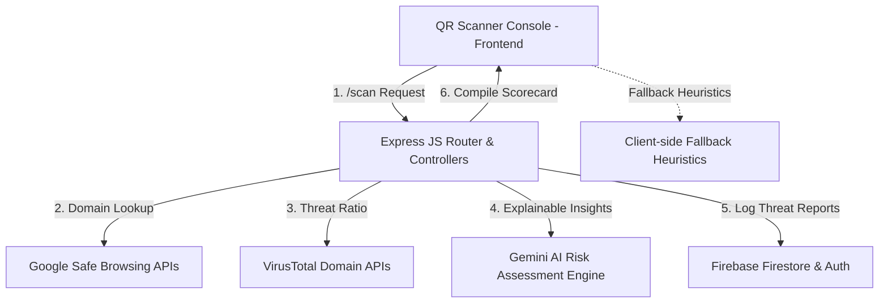

# QR Shield AI - Cybersecurity Threat Intelligence Platform

QR Shield AI is a full-stack, enterprise-grade cybersecurity application designed to defend users from malicious QR code fraud, phishing portals, typosquatting networks, and fake payment VPA gateways. The application uses a hybrid model of local static heuristics and advanced cloud threat intelligence engines.

---

## ⚡ Hackathon Auto-Demo Mode

The platform features an automated, zero-touch visual demo flow. 
To launch the showcase:
1. Load the landing page: `http://localhost:5000/index.html`.
2. Click the **⚡ Run Auto-Demo** button.
3. The platform will guide you automatically through:
   - **Stage 1 (Safe Scan)**: Simulates scanning `google.com` displaying verified clean records.
   - **Stage 2 (Phishing Scan)**: Simulates scanning a high-risk portal, playing sound alarms and flashing critical alerts.
   - **Stage 3 (Police SOC)**: Auto-logs in to the administrator portal and zooms maps dynamically to show coordinates.

---

## 🏗️ System Architecture

The platform is structured using a robust MVC folder separation pattern:



---

## 🌟 Key Features

1. **AI-Powered Threat Engine**: Integrates Google Safe Browsing, VirusTotal, and Gemini LLM API to assess risk scores dynamically.
2. **Police SOC Command Monitor**: Color-coded Leaflet.js maps tracking coordinate locations, Chart.js telemetry charts, and live security log feeds.
3. **PWA Integration**: Caches static resources and styles, functioning offline via custom Service Workers.
4. **Administrative Firewall Controls**: Direct forms to block domains, restrict UPI addresses, and elevate/demote client permissions.
5. **Secure Authentication**: Protected routes using JWT auth, password hashes, and Firebase Auth rules.

---

## 📁 Folder Structure

```
QR/
├── assets/                  # Frontend Static Assets
│   ├── css/                 # Core Styling Overrides
│   └── js/                  # Client Controllers & Models
│       ├── utils.js         # Theme & Global PWA Registrar
│       ├── scanner.js       # Camera Controls & Export triggers
│       ├── analysis.js      # Heuristics Fallback Core
│       └── history.js       # Local cache audit controller
├── backend/                 # Backend REST APIs Server
│   ├── config/              # Firebase & Database configuration
│   ├── controllers/         # MVC Controllers (auth, scan, admin)
│   ├── middleware/          # JWT Guard and Admin Gateways
│   ├── routes/              # Express API Routes
│   ├── services/            # Deep API integrations (Gemini, VT)
│   ├── server.js            # Express Entrypoint & Security Shields
│   └── package.json         # Node dependency lockbox
├── manifest.json            # PWA Metadata Configurations
├── service-worker.js        # Caching static fallback controller
├── offline.html             # Offline backup alert container
└── README.md                # Platform Documentation
```

---

## 🚀 Installation & Local Launch

### Prerequisites
- Node.js (v16.x or higher)
- Firebase Account credentials

### Setup Environment
Create a `.env` file inside the `backend/` folder:
```env
PORT=5000
OPENROUTER_API_KEY=your_gemini_openrouter_api_key
VIRUSTOTAL_API_KEY=your_virustotal_api_key
GOOGLE_SAFE_BROWSING_API_KEY=your_google_safe_browsing_api_key
JWT_SECRET=your_super_secure_jwt_token_key
```

### Install dependencies
```bash
# Navigate to backend folder
cd backend

# Install npm requirements
npm install
```

### Running Server
```bash
# Start server in production mode
npm start
```
The application will launch on **`http://localhost:5000`**.

---

## 🔒 Security Configuration
- **Rate Limiting**: Custom express-rate-limit prevents brute-force login loops.
- **XSS & Headers protection**: Protected with Helmet JS HTTP configurations.
- **Input Sanitization**: Automatically escapes payloads, preventing SQL/NoSQL Injection and Cross-Site Scripting (XSS).

---

## 📄 License
This project is licensed under the MIT License - see the LICENSE file for details.
